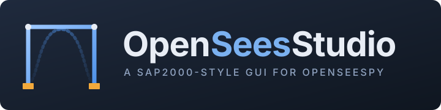
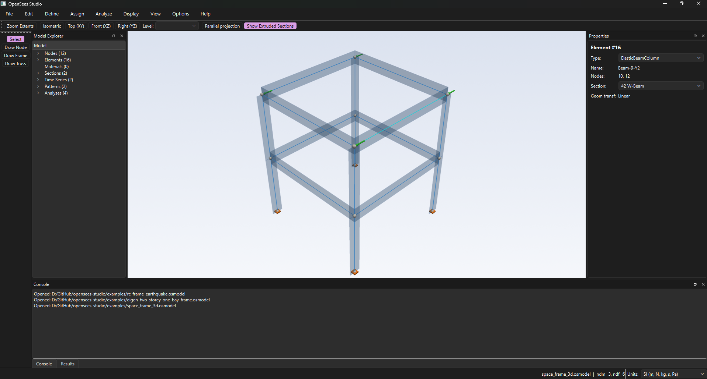

<p align="center">
  
</p>

<p align="center">
  A modern, SAP2000-style desktop GUI for
  <a href="https://openseespydoc.readthedocs.io/">OpenSeesPy</a> —
  built for structural and earthquake engineers who want a visual
  modeling environment without leaving the OpenSees ecosystem.
</p>

<p align="center">
  <em>Status: Pre-alpha. Active development. APIs and file formats will change.</em>
</p>

---



## Why

OpenSees is the gold-standard nonlinear FEM solver for earthquake
engineering, but its native interface is Tcl/Python scripts.
OpenSees Studio adds a visual front-end so you can:

- Click to draw nodes, frames, supports, and loads on a snapped grid.
- Assign materials, sections, and load patterns through dialogs.
- Run static, modal, pushover, and time-history analyses with progress
  and cancel support.
- Inspect results visually — deformed shape, mode shapes, force
  diagrams, pushover curves, time-history plots, hysteresis loops.
- Save the model as a single `.osmodel` JSON file that round-trips
  cleanly (diff-able in Git, scriptable from Python).

Behind the GUI, the same `core` Pydantic model is fully usable from a
script or Jupyter notebook — the GUI is one frontend, not the only one.

## What works today

- **Modeling** — grids, nodes, frames (elastic + force-based), trusses,
  quads, zero-length sections, restraints, equalDOF constraints,
  distributed loads, ground motions (`PathTimeSeries` /
  `UniformExcitation`).
- **Materials and sections** — `Steel01`, `Steel02`, `Concrete01`,
  `Concrete02`, `ElasticPP`, `Hysteretic`, fiber sections (rectangular /
  circular patches + rebar layers), `SectionAggregator`,
  `BeamWithHinges`.
- **Analyses** — static (load- or displacement-controlled), modal,
  displacement-controlled pushover, transient time-history with
  mode-1 Rayleigh damping. Chained workflows: gravity preload →
  `loadConst -time 0.0` → pushover or transient.
- **Post-processing** — deformed shape (with scale slider), animated
  mode shapes, axial / shear / moment diagrams, pushover curves
  (in display units), time-history plots, hysteresis loops,
  response-spectrum SRSS / CQC, snapshot + video export.
- **Persistence** — projects save as a single JSON `.osmodel` file
  (Pydantic-validated, round-trip-clean).
- **Examples** — 20+ verified examples bundled, including the OpenSees
  Wiki Examples-1 through Example-4 family and a fiber-section RC frame
  pushover. See [`examples/README.md`](examples/README.md).

## Tech stack

| Layer        | Library                              |
| ------------ | ------------------------------------ |
| GUI          | PySide6 (Qt 6)                       |
| 3D viewport  | PyVista + pyvistaqt (VTK)            |
| 2D plots     | pyqtgraph                            |
| Solver       | OpenSeesPy 3.8.0.0                   |
| Numerics     | NumPy                                |
| Storage      | Pydantic v2 (model), h5py (results)  |
| Tests        | pytest, pytest-qt                    |
| Lint / type  | ruff, mypy                           |

## Architecture

Strict MVVM + service layer. The `core` package is pure Python — no Qt,
no OpenSeesPy imports — and is fully unit-testable in isolation.

```
views (Qt)  →  viewmodels  →  services (OpenSeesRunner, Persistence)  →  core (model)
```

See [`docs/architecture.md`](docs/architecture.md) for the long form,
including the canonical OpenSeesPy command sequence the runner emits.

## Install (development)

**Desktop GUI** (includes Qt, PyVista, pyqtgraph, imageio):

```bash
git clone https://github.com/ogunc/opensees-studio.git
cd opensees-studio

python -m venv .venv
.venv\Scripts\activate              # Windows
source .venv/bin/activate           # Linux / macOS

pip install -e ".[gui,dev]"
```

**Headless / web reuse** (core + services only, no Qt pulled in):

```bash
pip install -e .
```

This installs only the headless base set (pydantic, numpy, h5py, openseespy).
It is the correct install for web backends, scripts, and Jupyter notebooks that
reuse `opensees_studio.core` or `opensees_studio.services` without the GUI.

Python 3.12 is required: the `openseespywin` and `openseespylinux` 3.8.0.0
wheels declare `Requires-Python >=3.12`, and the Windows `opensees.pyd` links
against `python312.dll` (so use 3.12 exactly on Windows). Pin both
`openseespy==3.8.0.0` and `openseespywin==3.8.0.0` (already pinned
in `pyproject.toml`).

## Quick start — the 60-second tour

```bash
python -m opensees_studio
```

Then:

1. **File → Open** → pick `examples/cantilever.osmodel`.
2. **Analyze → Cases** → run `Tip-Load`.
3. **Display → Show Force Diagram** → component **M3** → linear moment
   peaking at 50 kN·m at the fixed end. Component **V2** → constant
   -10 kN.
4. **Display → Show Deformed Shape** → the classic cantilever curve.

For a nonlinear walkthrough, open `examples/portal_pushover.osmodel`,
run the `Push-X` case, then **Display → Show Pushover Curve** — you'll
see the elastic ramp followed by a yield plateau as the fiber-section
hinges form at the column bases.

### Material Tester

**Define → Material Tester…** (Ctrl+Shift+T) opens a non-modal dialog that
drives one uniaxial material of the current project through a strain history
in an isolated zero-length model and plots stress against strain.

Protocols (all start in compression, the OpenSees sign convention):

- **Monotonic to amplitude**: 0 to -amplitude.
- **Symmetric cyclic, fixed amplitude**: N cycles of 0, -amplitude,
  +amplitude, 0.
- **Cyclic, increasing amplitude**: one such cycle per peak in a list of
  increasing peaks, for example `0.0025 0.005 0.01 0.02`.

*Steps per half-cycle* splits every branch (0 to peak, peak to opposite
peak, peak back to 0) into that many equal strain increments, so a cyclic run
records 3 × steps points per cycle.

Derived values under the plot:

- **Peak stress**: the stress of largest magnitude and the strain where it
  occurs.
- **Secant stiffness at peak**: peak stress divided by that strain.
- **Energy dissipated per cycle** (cyclic protocols): the area enclosed by
  each cycle, the integral of stress d(strain), in stress units (energy per
  unit volume).

**Export CSV…** writes two comment lines (`# material: …`, `# protocol: …`),
a header `strain,stress [<stress unit>]`, then one `strain,stress` row per
point with a point decimal separator. Only materials the tester can drive are
listed (nD `ElasticIsotropic` and `HystereticSM` are not); if a run still
fails, the dialog shows the error message instead of a curve.

### Ground motions

**Define → Ground Motions…** (Ctrl+Shift+G) manages the project's catalog of
acceleration records: import, metadata (PGA, D5-95 significant duration,
Arias intensity), an acceleration trace preview, remove, and relink.

Supported formats, auto-detected from content with an explicit override:

- **PEER AT2 / NGA**: header lines with `NPTS, DT` in either the new NGA or
  the old SMD spelling, values row-wise.
- **Two columns**: `time acceleration` pairs, whitespace or comma separated.
  The time step must be uniform; a non-uniform column is rejected.
- **Values only**: a bare list of accelerations (any number per line, read
  row-wise) plus a dt you provide.

Records are referenced, not embedded: the project file stores a path
relative to the `.osmodel` plus a sha256 content hash, and the sample values
are re-read from the record file on load. This keeps project files small and
diffable, and it respects the record providers' terms: PEER NGA records may
not be redistributed, so neither this repository nor your `.osmodel` files
carry them. Move a project together with its record files; if a file is
missing or its content changed, the catalog marks the record and analysis
refuses to run that case until you relink the file. A record imported into a
project that has never been saved keeps an absolute path until the first
save, which rewrites it relative to the new `.osmodel`.

**Spectra.** Selecting records plots their elastic response spectra
(pseudo-acceleration, 5 % damping, log period axis) in g. The oscillator
response uses the Nigam-Jennings piecewise-exact recurrence, so the spectrum
depends only on the record's own sampling. A record's samples are converted
to g from its **Units** (g or project units, set in the dialog; a PEER header
that says `IN UNITS OF G` sets it on import). Records with unknown units are
not plotted or scaled until you set them.

**Target spectrum.** Either the TBDY 2018 horizontal design spectrum from
SDS and SD1 as read from the AFAD TDTH map (TA = 0.2 SD1/SDS, TB = SD1/SDS,
TL = 6 s), or a user table of `period  Sa[g]` rows interpolated log-log. The
target is stored in the project and overlaid on the spectrum plot.

**Scaling.** Three methods, previewed before Apply:

- **PGA**: factor so the record's PGA equals a target PGA in g.
- **Sa(T1)**: factor so the record's Sa at the structure's period T1 equals
  the target's.
- **Period range**: factors for the selected set so the mean spectrum of the
  scaled set is not below alpha times the target over [a T1, b T1], either
  one uniform factor or individual factors (each record first fitted to the
  target shape, then the same uniform step); consecutive selections can be
  paired as H1, H2 with the SRSS of the pair. The preset "TBDY 2018 (engineer
  to confirm)" uses a = 0.2, b = 1.5 and alpha = 1.3 for pairs; confirm it
  against the standard before relying on it. The preview reports the
  governing period and the minimum mean-to-target ratio.

Scale factors live on the time series: Apply writes `PathTimeSeries.factor`
(which also carries the g to project-unit conversion) through one undoable
command, and the catalog record itself is never changed.

## Run the test suite

```bash
pytest tests/unit          # pure-logic tests, milliseconds
pytest tests/gui           # Qt event-loop tests (pytest-qt)
pytest tests/integration   # real OpenSeesPy runs on bundled examples
```

CI runs lint + the non-`slow` subset on Linux / macOS / Windows
× Python 3.12.

## Roadmap

See [`docs/roadmap.md`](docs/roadmap.md) for the phase-by-phase plan.
Phases 0–7 (modeling, analysis, post-processing) are largely done.
Phase 8 (earthquake-engineering primitives — isolators, ground-motion
library, IDA, fiber-section editor polish) is the active edge.

## We're looking for collaborators

This project is most useful to researchers and engineers who already
work with OpenSees and want a faster path from "idea" to "model" —
**and who would rather build that path together than alone.**

If any of the following sounds like you, please open an issue or
say hi:

- 🌉 **Structural / earthquake engineers** comfortable with OpenSees Tcl
  or OpenSeesPy who can spot when a feature is "almost right but not
  quite" — that calibration feedback is gold.
- 🧪 **Researchers** running pushover, IDA, or response-spectrum studies
  who want to validate the GUI against their hand-built scripts.
- 🐍 **Python / Qt developers** interested in scientific desktop apps,
  PyVista / VTK rendering, or Pydantic-driven schema design.
- 📚 **Students** who want to learn structural FEM and modern GUI
  architecture at the same time — example walkthroughs and tests are
  designed to read as documentation.
- 🎨 **UX / icon designers** willing to help shape the dialog set,
  toolbar icons, and overall visual language.

Open issues, bug reports, and reproducible test cases are just as
valuable as code. See [`CONTRIBUTING.md`](CONTRIBUTING.md) for the dev
setup and the architectural rules enforced in review.

## License

OpenSees Studio is released under the **GNU Affero General Public
License v3.0** ([`LICENSE`](LICENSE)).

Plain-language summary (not legal advice — read the license itself):

- ✅ Use it for **research, education, and personal projects** with no
  obligation other than keeping the copyright notice intact.
- ✅ Modify and fork it freely.
- ⚠️ If you **distribute** it, modified or not, you must release your
  full source under AGPL-3.0.
- ⚠️ If you **run it as a network service** (e.g. host a modified
  version as a SaaS), you must release your modifications under
  AGPL-3.0.

In other words: anyone is free to learn from and build on this code,
but commercial forks and proprietary derivatives must contribute their
changes back to the community. If your use case needs a different
arrangement (e.g. a closed-source commercial license), please open an
issue to discuss.

Copyright © 2026 Ozan and contributors.
